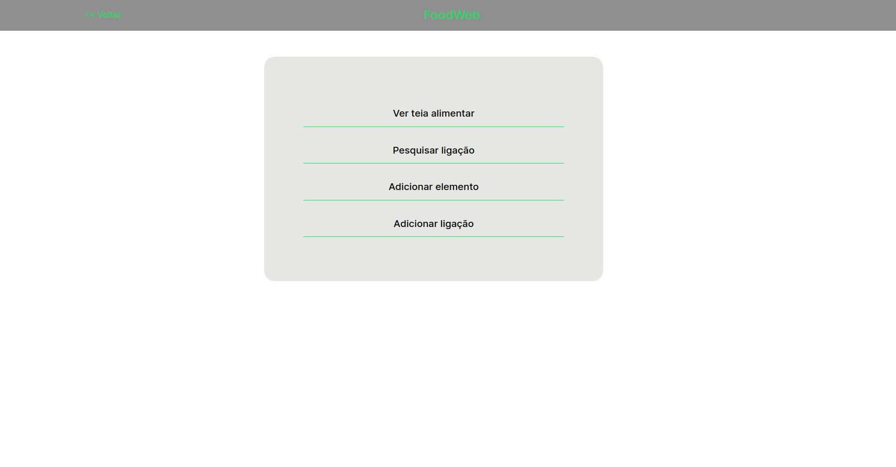
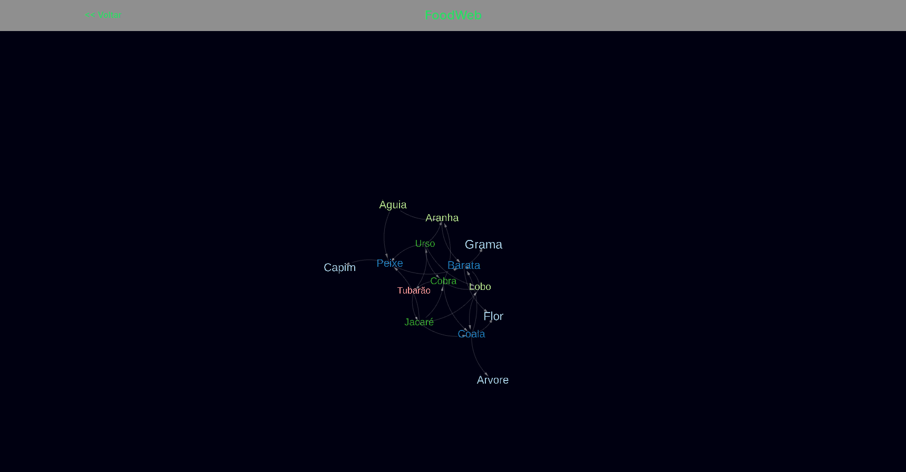
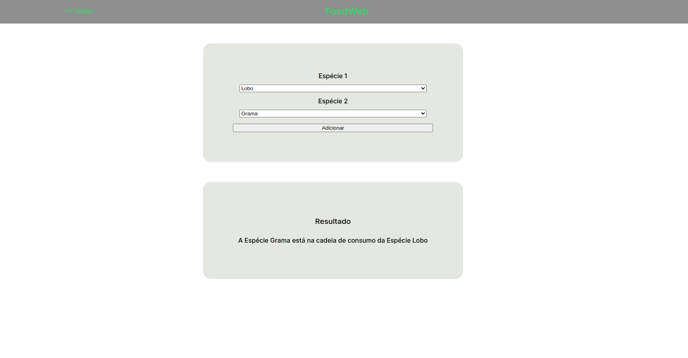

# FoodWeb

**Número da Lista**: 6<br>
**Conteúdo da Disciplina**: Grafos1<br>

## Alunos
|Matrícula | Aluno |
| -- | -- |
| 19/0056843  |  Carlos Eduardo de Sousa Fiuza |
| 19/0055201  |  Matheus Calixto Vaz Pinheiro |

## Sobre 
Trata-se de uma aplicação de grafo no mundo real, adaptando-a para representar uma teia alimentar. O trabalho consiste em uma interface para visualização da teia alimentar, adição de nós, adição de arestas e pesquisa por caminhos.

## Screenshots
<div align="center">
    </img>
</div>
<br/>
<div align="center">
    </img>
</div>
<br/>
<div align="center">
    </img>
</div>


## Instalação 
**Linguagem**: Javascript<br>
**Framework**: React<br>
Possuir node instalado e npm ou yarn.

## Uso
Use o link para acessar a aplicação deployada: [link](https://grafos1-food-web.vercel.app/)

Ou execute em ambiente local:

1 - Baixe o repositório usando o git clone
2 - Entre na pasta Grafos1_FoodWeb/vite-project
3 - Execute o comando:
```bash
npm run dev
```


